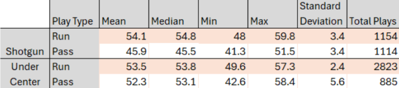
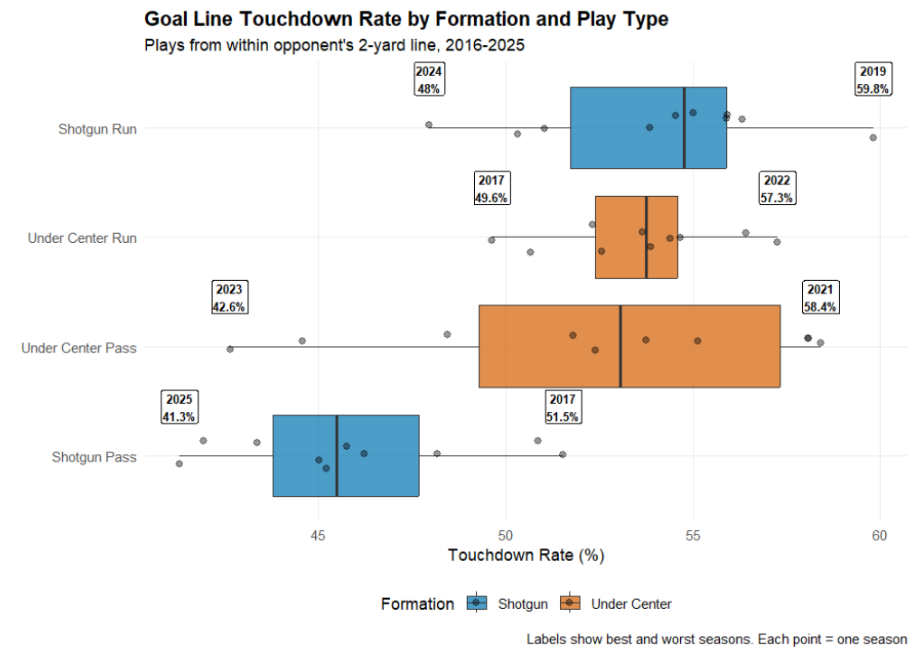

## Defining the Goal Line
The third and short findings establish that formation and play choices carry measurable consequences in critical conversion situations, but no situation in football highlights those consequences more than the goal line, where a single yard separates a touchdown from a field goal attempt. The goal line, defined here as plays from within the opponent's second yard line, represents the highest-leverage field position in football, where defenses are focused on every move. The formation data from these situations reveals several findings that inform the predictive modeling's treatment of red zone and goal line scenarios.

{fig-align="center"}

Shotgun runs led all combinations with a median touchdown rate of 54.8 percent across the decade, followed closely by under center runs at 53.8 percent and under center passes at 53.1 percent, with shotgun passes trailing significantly at 45.5 percent. The ~9% gap in median performance between shotgun runs and shotgun passes at the goal line reflects the disadvantage of passing from a spread alignment when the field is compressed and defensive backs can play tight coverage with no deep field responsibility. This makes it even more intriguing that shotgun usage at the goal line splits nearly evenly between runs and passes at 1,154 and 1,114 plays respectively, despite the efficiency gap between them being so drastic. The success of shotgun runs is somewhat surprising given conventional wisdom about power formations near the goal line, though the compressed field and the frequency with which shotgun runs in this zone include quarterback runs or RPO concepts could partially explain the result. 

{fig-align="center"}

Under center run shows the tightest distribution of any combination with a standard deviation of just 2.4 percentage points, meaning its effectiveness is highly consistent year to year regardless of personnel or scheme variation. Under center pass shows a standard deviation of 5.60, 2.3 times the variance of under center run, and while three individual seasons produced under center pass conversion rates exceeding the best under center run season in the dataset, the worst under center pass season converted at 42.6 percent, fully 7 percentage points below the worst under center run season of 49.6 percent. Under center passes near the goal line, likely reflecting play action concepts in the majority of cases, though the data cannot confirm this directly, are clearly the highest-risk highest-reward playcall. When defenses commit to stopping the run and successfully read play action, the results can be significantly worse than any under center run outcome in the sample. These results mirror the findings from examining playcalls on 3rd and short, that runs of either formation are safer play calls in short yardage scenarios.
