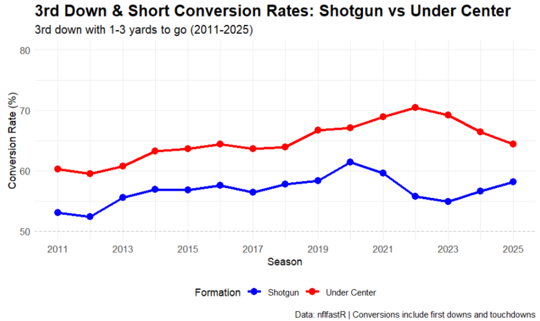
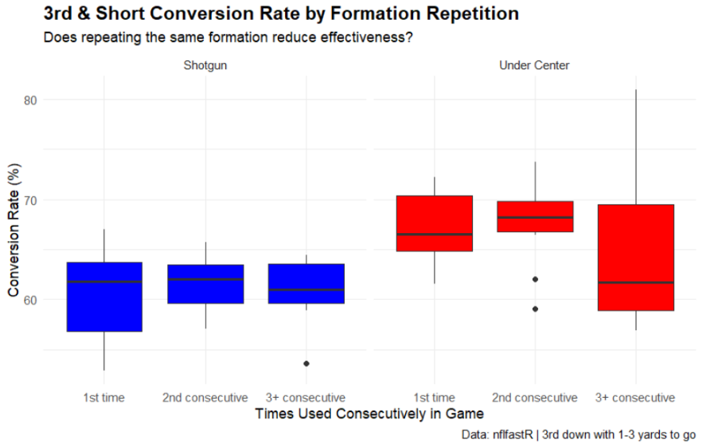

```{=html}
<div class="section-intro">
  This section isolates 3rd and short situations to examine whether formation choice meaningfully predicts conversion rates, and tests whether repetition and predictability erode the value of a favored formation after each use.
</div>
```

## Why 3rd and Short?

Among all game situations, third and short represents one of the most consequential formation decisions in football. Sustaining the drive and boosting your likelihood to put points on the board can change the course of the game. Defensive coordinators play their best personnel and dial up pressure or advanced coverages to try and confuse the quarterback, and coaches face the most tangible tradeoff between their choice of formation and the ability to execute successfully.

## The Formation Conversion Gap

{fig-align="center"}

The data across fifteen seasons reveals a consistent performance gap between the two formations in this critical situation. Under center formations have converted third and short situations at a consistently higher rate than shotgun across every season in the dataset. In 2011, the gap was 7.2 percentage points, 60.2 percent for under center versus 53.0 percent for shotgun. By 2022, that gap had roughly doubled to 14.6 percentage points, 70.4 percent for under center against 55.8 percent for shotgun. The trend is particularly notable given the simultaneous increase in shotgun usage on third and short, suggesting that teams are calling shotgun more frequently in this situation even with its relative disadvantage.

The 2021 to 2023 seasons show the under center advantage reaching its modern peak, with conversion rates of 68.9, 70.4 and 69.2 percent respectively compared to shotgun's 59.5, 55.8, and 54.9 percent. This raises the question of why under center is so effective compared to shotgun, and whether there is some aspect of predictability when these formations are called.

## Formation Repetition and the Element of Surprise

One of the more in depth questions play-by-play data enables is whether formation repetition affects conversion success, where defenses adapt within games to punish predictable formation tendencies. When looking at the streak analysis of third and short situations across the past decade, tracking conversion rates based on how many consecutive times a team had used the same formation produces an interesting result. I looked at 2016-2025 seasons to specifically focus on playcalls within modern shotgun-heavy schemes, and the results challenge the intuitive assumption that defensive adaptation punishes formation repetition.

## Streak and Repetition Analysis
{fig-align="center"}

Under center formations converted at a median rate of 66.5 percent on first usage, 68.2 percent on second consecutive usage, and 61.7 percent on third or more consecutive usage, holding relatively steady across streak lengths before modest decline when repeating three plus times. Variance also increases significantly on the third attempt, signaling that performance highly depends on a team's ability to either consistently execute run plays well or sell the play-action. 

Shotgun tells a similar story: converting at a median rate of 61.8 percent on first usage, the rate improved slightly to 62.0 percent on second consecutive usage before settling at 61.0 percent on third or more, essentially remaining the same across each repetition. However, the variance in shotgun success decreases when used repetitively. One possible explanation for this is that more often than not the teams willing to call shotgun at least 3 times in a row predominantly use shotgun-heavy schemes and are typically more efficient as a result. The fact that under center is just as, if not more, successful than shotgun even after using it three times in a row suggests that power run concepts, combined with the ability to catch defenses off guard with play-action, are difficult to defend regardless of how many times a team signals its intent through alignment.

##Importance of Execution over the Element of Surprise
These findings lead us to a notable difference between the formations being not in the trend across streak lengths but in the variance. Under center's third or more consecutive usage shows a standard deviation of 8.29 percentage points, roughly 2.5 times the 3.24 of shotgun in the same category, driven largely by the 2021 season where under center formations used three or more consecutive times converted at 81.0 percent. The skew patterns reveal an interesting asymmetry between the two formations. For shotgun, first usage is left skewed with a few poor seasons dragging the average below what most teams typically experience. Third or more consecutive usage is right skewed, meaning a few exceptional seasons inflate the average above the typical outcome. Second usage shows no skew, making it the most predictable and stable point in the shotgun streak sequence. Under center shows right skew on both first and third or more consecutive usage, indicating that outlier high-performing seasons pull the averages upward in both cases, with the extreme 2021 value of 81.0 percent on extended streaks being the clearest example. 

This pattern is consistent with the consensus that under center's correlation with power-run makes it difficult to defend regardless of repetition. The formation signals a run, and executing a quality run from under center keeps efficiency high whether calling a run or play-action on the first or fourth consecutive usage. Teams who struggle with executing runs at a high-level struggle to activate their play-action game as a byproduct. Shotgun, by contrast, derives most of its effectiveness from signaling the likelihood of a pass play, meaning repeated shotgun usage allows defenses to settle into coverage responsibilities that reduce the formation's overall effectiveness.
